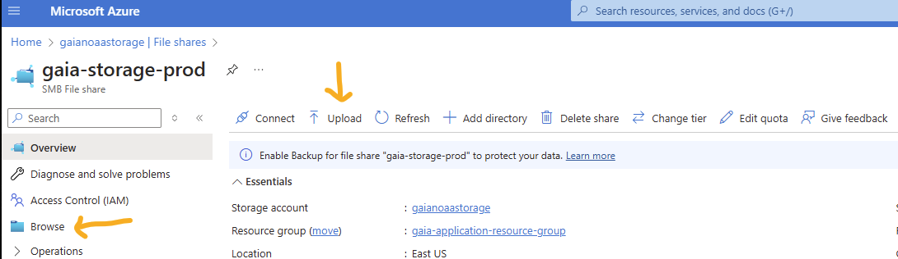

# Create a new Azure container app, e.g: test

### Steps
Following this doc:
https://learn.microsoft.com/en-us/azure/container-apps/storage-mounts-azure-files?tabs=bash

1. Setup
```bash
RESOURCE_GROUP=gaia-application-resource-group
STORAGE_ACCOUNT=gaianoaastorage
MANAGED_ENVIRONMENT=managedEnvironment-gaiaapplication-84b6
GITHUB_REGISTRY_USERNAME=bob-smith
```

2. Create storage
```bash
az storage share-rm create --resource-group $RESOURCE_GROUP --storage-account $STORAGE_ACCOUNT --name gaia-storage-test --quota 1024 --enabled-protocols SMB --output table
```

3. Get key
```bash
STORAGE_ACCOUNT_KEY=`az storage account keys list -n $STORAGE_ACCOUNT --query "[0].value" -o tsv`

echo $STORAGE_ACCOUNT_KEY:
xxxx
```

4. Set the storage
```bash
az containerapp env storage set --access-mode ReadWrite --azure-file-account-name $STORAGE_ACCOUNT --azure-file-account-key $STORAGE_ACCOUNT_KEY --azure-file-share-name gaia-storage-test --storage-name gaia-storage-mount-test --name $MANAGED_ENVIRONMENT --resource-group $RESOURCE_GROUP --output table
```

    The behavior of this command has been altered by the following extension: containerapp
    Name                     ResourceGroup
    -----------------------  -------------------------------
    gaia-storage-mount-test  gaia-application-resource-group

5. Upload the sqlite database



6. Create a starting container
```bash
az containerapp create --min-replicas 1 --max-replicas 1 --name gaia-test --resource-group $RESOURCE_GROUP --environment $MANAGED_ENVIRONMENT --registry-server ghcr.io --image ghcr.io/nefsc/psd-web-gaia:dev-xxx --registry-password xxx --registry-username $GITHUB_REGISTRY_USERNAME -o yaml
```

    The behavior of this command has been altered by the following extension: containerapp
    Adding registry password as a secret with name "ghcrio-bob-smith"

7. Add the ingress
```bash
az containerapp ingress enable -n gaia-test -g $RESOURCE_GROUP --type external --target-port 8000 --transport auto
```

8. Update generated yaml
* Add secrets-json via portal to app. TODO: maybe use key vault instead?

9. Update app with volumes and secrets added
```bash
az containerapp update -n gaia-test -g $RESOURCE_GROUP --yaml azure/containerapp-test.yaml
```

Check it
```bash
az containerapp exec --name gaia-test --resource-group $RESOURCE_GROUP --command "/bin/bash"

Create redis container (dev example)
```bash
az containerapp create \
    --name redis-cache-dev \
    --resource-group $RESOURCE_GROUP \
    --environment $MANAGED_ENVIRONMENT \
    --image redis:8-alpine \
    --ingress internal \
    --transport tcp \
    --target-port 6379 \
    --cpu 0.5 \
    --memory 1Gi